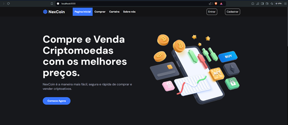

# Nexcoin

# Nexcoin




A Nexcoin tem como objetivo facilitar o acesso ao mercado de criptomoedas, oferecendo uma plataforma segura, ágil e transparente para compra e venda de moedas digitais. Nossa missão é promover a inclusão financeira através da inovação, conectando investidores iniciantes e experientes ao mundo das criptomoedas, com suporte especializado e ferramentas avançadas.

## Funcionalidades Principais

### 1. Cadastro de Usuários
- Permite que novos usuários se cadastrem na plataforma com autenticação por e-mail.
- Sistema de login e logout seguro.

### 2. Dashboard Personalizado
- Painel exclusivo para cada usuário, com informações de saldo, histórico de transações e cotações em tempo real.

### 3. API para Cotação de Criptomoedas
- Integração com a API da CoinGecko para obter cotações atualizadas de diversas criptomoedas.
- Exibição de gráficos mostrando a evolução das cotações para auxiliar na análise de mercado.

### 4. Controle de Acesso
- Autenticação de usuários e controle de acesso por meio de grupos de permissões (usuários comuns, administradores, etc.), utilizando o sistema de autenticação do Django.
- Acesso restrito a páginas, como o dashboard, área de transações e carteiras digitais, somente para usuários autenticados.
- Administração de transações: administradores podem gerenciar usuários e operações.

### 5. Gestão de Criptomoedas
- Carteira virtual individual para cada usuário, com controle de saldo e transações.

## Arquitetura do Projeto
O projeto foi desenvolvido utilizando a arquitetura MVT (Model-View-Template) do Django. As principais entidades e suas funções incluem:
- **Usuários:** Gerenciamento de perfil, autenticação e autorização.
- **Transações:** Registro e histórico das operações de compra e venda de criptomoedas.
- **Cotações:** Exibição de dados de mercado em tempo real.

## Configuração do Projeto

### Pré-requisitos
- Python 3.x
- Django 4.x
- Dependências listadas no arquivo `requirements.txt`

### Passos para Instalação
1. Clone o repositório:
    ```bash
    git clone https://github.com/sua-conta/nexcoin.git
    cd nexcoin
    ```

2. Crie e ative um ambiente virtual:
    ```bash
    python -m venv venv
    source venv/bin/activate  # No Windows, use: venv\Scripts\activate
    ```

3. Instale as dependências:
    ```bash
    pip install -r requirements.txt
    ```

4. Configure as variáveis de ambiente e ajuste as configurações no `settings.py`.

5. Aplique as migrações do banco de dados:
    ```bash
    python manage.py migrate
    ```

6. Inicie o servidor de desenvolvimento:
    ```bash
    python manage.py runserver
    ```

### Testes
Para rodar os testes:
```bash
python manage.py test
